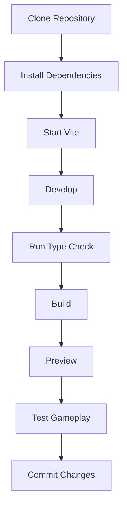

# Installation Guide

## BAD DECISION

This document covers local setup, development, validation, and production builds.

## 1. Requirements

Recommended:

- Git
- Node.js with npm, or Bun
- A modern Chromium, Firefox, or Safari browser
- Windows, macOS, or Linux

The repository includes `bun.lock`, so Bun is the preferred package manager when available.

## 2. Clone the Repository

```bash
git clone https://github.com/Devputta/BAD-DECISION.git
cd BAD-DECISION
```

## 3. Install Dependencies

### Bun

```bash
bun install
```

### npm

```bash
npm install
```

## 4. Start Development

### Bun

```bash
bun run dev
```

### npm

```bash
npm run dev
```

The Vite development server is configured to run on:

```text
http://localhost:3000
```

## 5. Type Check

The repository provides a `lint` script that runs the TypeScript compiler without emitting files.

### Bun

```bash
bun run lint
```

### npm

```bash
npm run lint
```

## 6. Production Build

### Bun

```bash
bun run build
```

### npm

```bash
npm run build
```

The production output is generated in:

```text
dist/
```

## 7. Preview the Production Build

### Bun

```bash
bun run preview
```

### npm

```bash
npm run preview
```

## 8. Environment Variables

The repository contains:

```text
.env.example
```

Copy it to a local environment file only when environment configuration is required by the implementation:

```bash
cp .env.example .env
```

On Windows Command Prompt:

```bat
copy .env.example .env
```

Do not commit `.env` or other files containing secrets.

The current core game does not require a backend service for gameplay or local progress.

## 9. Recommended Development Workflow



## 10. Troubleshooting

### Port already in use

The development script uses port `3000`.

If another process is using that port, stop the conflicting process or adjust the Vite configuration/script as appropriate.

### Dependency installation issues

Try:

```bash
npm install
```

or, when using Bun:

```bash
bun install
```

Avoid mixing package managers repeatedly in the same working tree unless necessary.

### Type errors

Run:

```bash
npm run lint
```

Review the reported TypeScript errors before creating a production build.

### Build errors

Run:

```bash
npm run build
```

Fix the first reported error, then run the build again.

### Saved game state appears incorrect

The game stores progress in browser `localStorage`. Clear the site's local storage and reload the application to return to a clean progress state.

## 11. Deployment

Build the application:

```bash
npm run build
```

Deploy the generated:

```text
dist/
```

directory using a hosting provider that supports Vite/static frontend deployments.

## 12. Release Checklist

```text
[ ] Dependencies installed
[ ] Type check passes
[ ] Production build passes
[ ] Main menu tested
[ ] Chamber selection tested
[ ] Failure states tested
[ ] Victory states tested
[ ] Reset behavior tested
[ ] Progress persistence tested
[ ] Sound toggle tested
[ ] Dark/light theme tested
[ ] Keyboard controls tested
[ ] Mobile layout checked
[ ] No secrets committed
[ ] Production deployment verified
```
