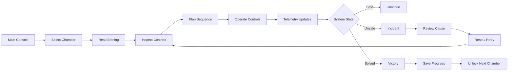
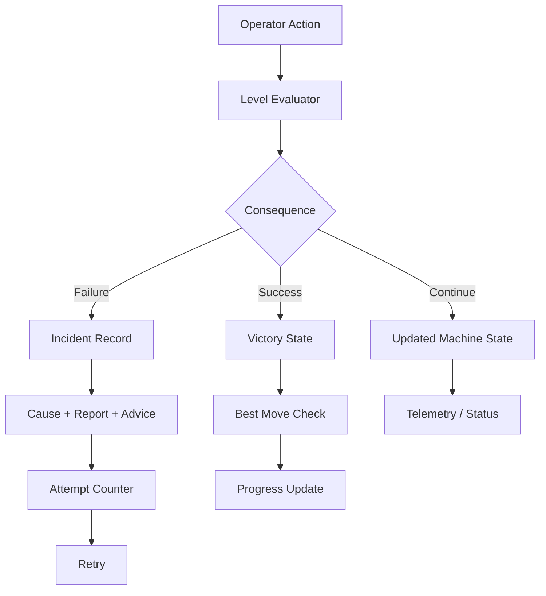
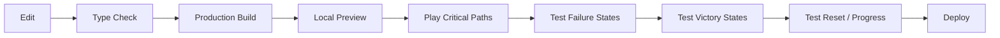

# BAD DECISION

[](https://bad-decision-mjjxncbwu.vercel.app/)
[](https://react.dev/)
[](https://www.typescriptlang.org/)
[](https://vite.dev/)
[](https://tailwindcss.com/)
[](LICENSE)

> A browser-based consequence puzzle game built around mechanical controls, telemetry, procedural thinking, and failure analysis.

## Overview

**BAD DECISION** is an interactive control-room puzzle game where every chamber presents a machine state, a set of physical-style controls, telemetry, operating constraints, and consequences.

The game is designed around a simple idea:

```text
Observe → Understand → Plan → Act → System Responds → Learn → Retry → Solve
```

Instead of relying on conventional puzzle menus, the interface presents switches, levers, breakers, dials, gauges, status messages, incident reports, and operating notes as parts of a simulated control system.

## Live Demo

[Open BAD DECISION](https://bad-decision-mjjxncbwu.vercel.app/)

## Highlights

- 50 playable chambers built from handcrafted core scenarios and generated extended scenarios.
- Mechanical-style switches, levers, dials, breakers, and other actuators.
- Telemetry gauges connected to the active game state.
- Failure states with incident title, cause, report, and recovery advice.
- Victory states with move tracking and progression.
- Best-move tracking for completed chambers.
- Incident archive for recorded failures.
- Progressive unlocking of chambers.
- Declassified solution support after repeated failed attempts.
- Keyboard controls for faster interaction.
- Sound effects for switching, steam, catastrophe, and successful clearance.
- Dark and light interface themes.
- Browser-local progress persistence through `localStorage`.
- Responsive interface components for desktop and smaller screens.

## Game Flow



## Failure Analysis Flow



## Application Architecture

```text
Browser
│
├── React Application
│   ├── App State
│   ├── Game Modes
│   ├── Level Selection
│   ├── Progress Handling
│   └── Theme Handling
│
├── Game Engine
│   ├── Level Definitions
│   ├── Initial State
│   ├── Interactive Objects
│   ├── Telemetry Gauges
│   └── Consequence Evaluation
│
├── UI Layer
│   ├── Control Room
│   ├── Mechanical Controls
│   ├── Gauges
│   ├── Strip Chart
│   ├── Incident Modal
│   ├── Victory Modal
│   ├── Hint Modal
│   └── Incident Archive
│
├── Audio Layer
│   └── Web Audio / Game Sound Controller
│
└── Browser Storage
    └── localStorage
        ├── Unlocked Levels
        ├── Best Moves
        ├── Incidents
        ├── Sound Preference
        └── Attempt Counts
```

## Core Game Model

Each chamber is represented by a `LevelDefinition`.

A chamber contains:

| Component | Purpose |
|---|---|
| Level metadata | Number, title, subtitle, theme |
| Objective | Defines the required outcome |
| Briefing | Establishes the operating context |
| Warning | Highlights a critical constraint |
| Solution hint | Provides optional guidance |
| Solution steps | Describes a valid operating sequence |
| Initial state | Defines the machine starting condition |
| Interactive objects | Defines controls and available states |
| Telemetry gauges | Visualizes machine values |
| Status message | Communicates current operating state |
| Evaluator | Determines continuation, failure, or victory |
| Move limits | Controls the permitted operation cycle |

## Chamber Progression

The current source combines:

- 5 core handcrafted chambers in `src/levels/data.ts`
- 45 extended chambers generated by `generateExtendedLevels()` in `src/levels/extendedLevels.ts`

Total:

```text
5 Core Chambers
       +
45 Extended Chambers
       =
50 Chambers
```

The extended scenarios cover themes including:

- Hydrostatics and fluids
- High voltage and dielectrics
- Thermodynamics and steam
- Pneumatics and gas flow
- Nuclear and radiation systems
- Mechanical inertia
- Cryogenics and phase systems
- Chemical reaction systems
- Apex terminal facility scenarios

## Project Structure

```text
bad-decision/
├── index.html
├── package.json
├── bun.lock
├── tsconfig.json
├── vite.config.ts
├── metadata.json
├── .env.example
├── .gitignore
│
├── public/
│
└── src/
    ├── App.tsx
    ├── main.tsx
    ├── index.css
    │
    ├── assets/
    │   └── images/
    │
    ├── audio/
    │   └── sound.ts
    │
    ├── components/
    │   ├── AnalogGauge.tsx
    │   ├── ControlRoom.tsx
    │   ├── DeclassifiedSolutionModal.tsx
    │   ├── Gauge3D.tsx
    │   ├── HintModal.tsx
    │   ├── IncidentArchive.tsx
    │   ├── IncidentModal.tsx
    │   ├── LevelVictoryModal.tsx
    │   ├── MechanicalSwitch.tsx
    │   ├── StripChart.tsx
    │   ├── TitleMenu.tsx
    │   └── TopBar.tsx
    │
    ├── levels/
    │   ├── data.ts
    │   └── extendedLevels.ts
    │
    ├── storage/
    │   └── progress.ts
    │
    └── types/
        └── game.ts
```

## Technology Stack

| Area | Technology |
|---|---|
| UI | React 19 |
| Language | TypeScript |
| Build Tool | Vite 8 |
| Styling | Tailwind CSS 4 + project CSS |
| Icons | Lucide React |
| Motion | Motion |
| Audio / Effects | Browser audio and canvas-confetti |
| Persistence | Browser `localStorage` |
| Package Lock | Bun |
| Runtime | Modern web browser |

## Installation

### Prerequisites

Install one of the following:

- Node.js with npm
- Bun

A current modern browser is recommended for development and gameplay.

### Option A — Bun

```bash
git clone https://github.com/Devputta/BAD-DECISION.git
cd BAD-DECISION
bun install
bun run dev
```

Open:

```text
http://localhost:3000
```

### Option B — npm

```bash
git clone https://github.com/Devputta/BAD-DECISION.git
cd BAD-DECISION
npm install
npm run dev
```

Open:

```text
http://localhost:3000
```

## Production Build

Using Bun:

```bash
bun run build
```

Using npm:

```bash
npm run build
```

Preview the production build:

```bash
bun run preview
```

or:

```bash
npm run preview
```

## Available Scripts

| Script | Purpose |
|---|---|
| `dev` | Starts the Vite development server on port 3000 |
| `build` | Creates a production build |
| `preview` | Serves the production build locally |
| `lint` | Runs TypeScript type checking |
| `clean` | Removes generated build/server artifacts |

Run type checking with:

```bash
bun run lint
```

or:

```bash
npm run lint
```

## Controls

### Keyboard

| Key | Action |
|---|---|
| `1` – `9` | Operate the corresponding available control |
| `R` | Reset the current chamber |
| `ESC` | Return to the main console / close active overlays |

Mouse and touch interaction can be used with the visible controls.

## Progress and Storage

The game stores progress in the browser using `localStorage`.

The stored game data includes:

```text
Unlocked levels
Best move counts
Incident history
Sound preference
Level attempt counts
```

The application validates stored values when loading progress and falls back to a clean default state if stored data is invalid.

No application server is required for the current game state and progress system.

### Reset Local Progress

To reset saved progress, clear the site's local storage for the deployed or local domain using the browser's developer tools or site-data controls.

## Theme

The interface supports two visual modes:

```text
Dark
Light
```

The selected theme is stored locally in the browser.

## Safety Note

BAD DECISION is a software simulation and puzzle experience.

The scenarios use terminology and concepts inspired by industrial control systems, electrical systems, pressure systems, mechanical equipment, chemical processes, and other technical environments. The game should not be treated as an operational procedure, engineering manual, or real-world safety instruction.

Do not use the game's instructions as guidance for operating real machinery or hazardous equipment.

## Development Principles

The project is structured around:

- State-driven interactions
- Explicit consequence evaluation
- Observable telemetry
- Clear failure reporting
- Repeatable level behavior
- Local persistence
- Small reusable UI components
- Separation between level definitions and interface components

## Validation Flow

Before release:



Recommended commands:

```bash
npm run lint
npm run build
npm run preview
```

## Deployment

The application is a Vite client-side application and can be deployed to static hosting or platforms that support Vite builds.

Typical production output:

```text
dist/
```

The current live deployment is available at:

https://bad-decision-mjjxncbwu.vercel.app/

## Environment Configuration

The repository contains `.env.example`.

Before adding environment variables, verify that the application actually consumes them. Do not commit real secrets.

The current game source does not require a server-side API for its core gameplay or local progress system.

## Contribution Guidelines

When modifying the project:

1. Keep game state transitions deterministic where possible.
2. Keep level-specific rules inside level definitions.
3. Avoid putting chamber-specific logic into reusable UI components unless necessary.
4. Preserve keyboard accessibility when adding controls.
5. Validate failure and victory conditions after changing a level.
6. Avoid committing secrets or local environment files.
7. Run type checking and a production build before opening a pull request.
8. Keep dependency changes intentional and documented.

## License

This project is distributed under the MIT License.

See [LICENSE](LICENSE) for the complete license text.

## Security

Security-related guidance is available in [SECURITY.md](SECURITY.md).

## Documentation

- [Installation Guide](INSTALL.md)
- [Security Policy](SECURITY.md)
- [MIT License](LICENSE)
